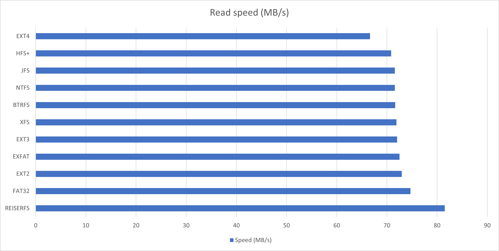
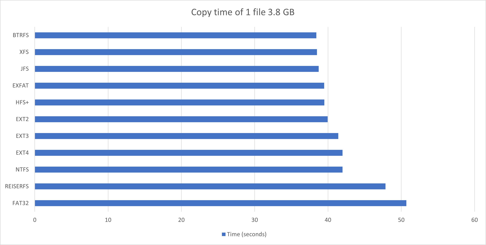
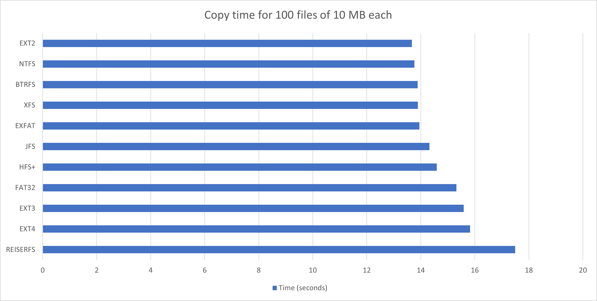
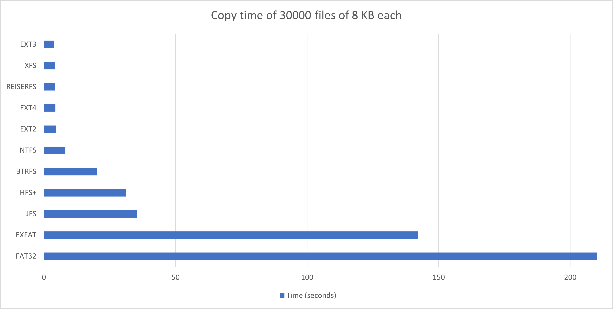
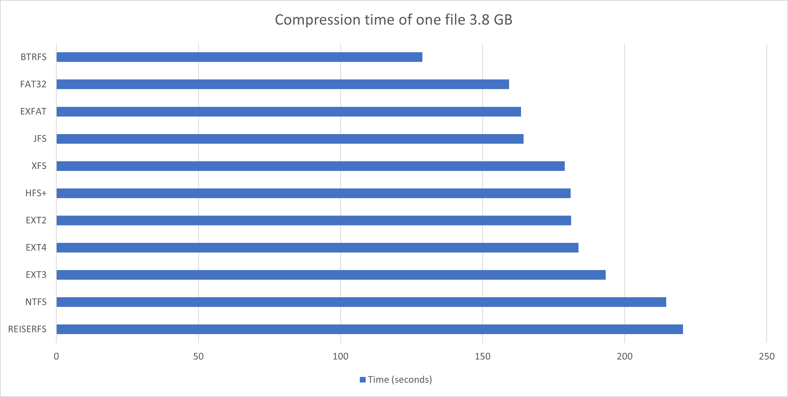
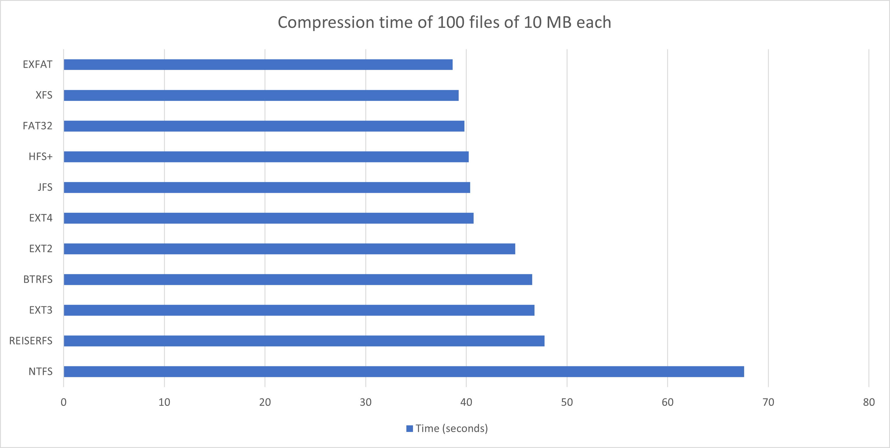
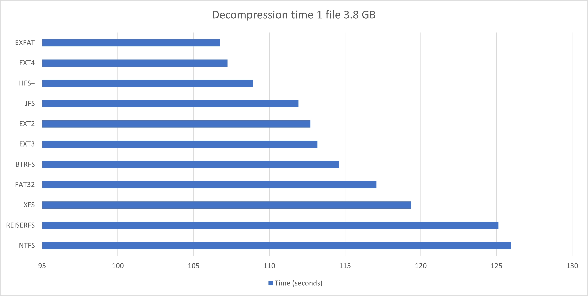
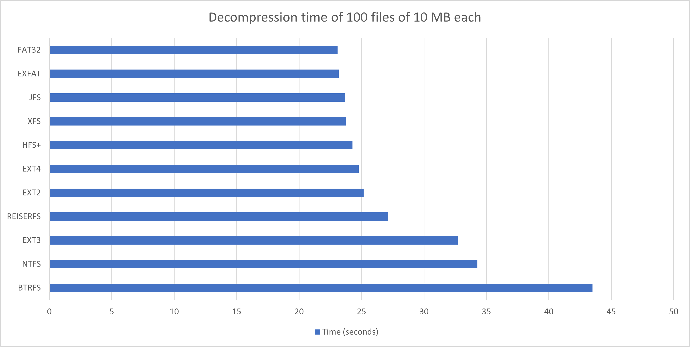
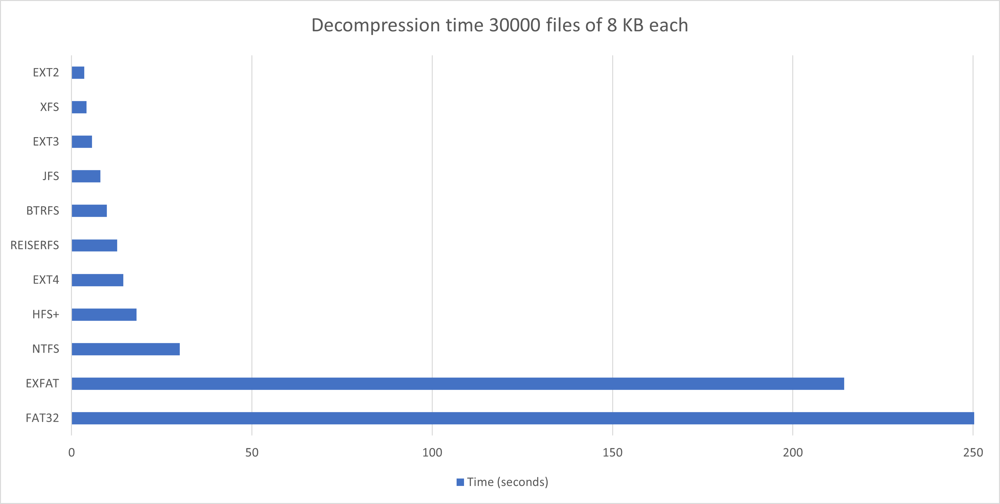
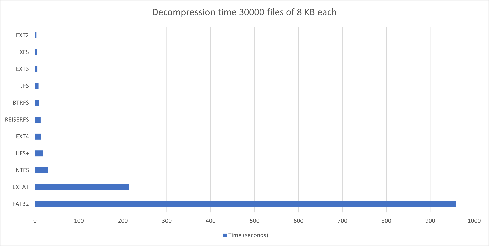

# Summary (HDD)
The summary includes a brief conclusion and a chart made in Microsoft Excel

## Read speed

## Copy time

### 1 file 3.8 GB

### 100 files of 10 MB each

### 30000 files of 8 KB each

## Compression time

### 1 file 3.8 GB

### 100 files of 10 MB each

### 30000 files of 8 KB each

## Decompression time

### 1 file 3.8 GB

### 100 files of 10 MB each

### 30000 files of 8 KB each

#### Limit x to 250

#### Limit x to 700

## Conclusion
The results are interesting, they are slightly different than on the SSD. NTFS turned out to be much better here than on the SSD. Even when copying 100 files of 10 MB each, it comes in second place!