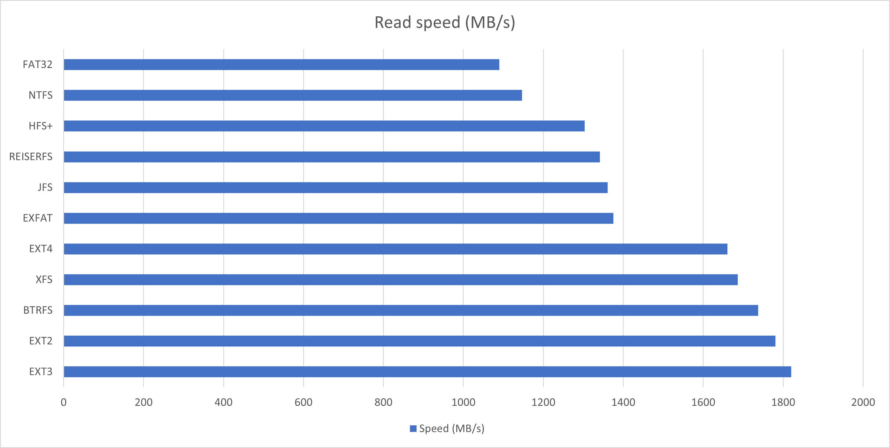
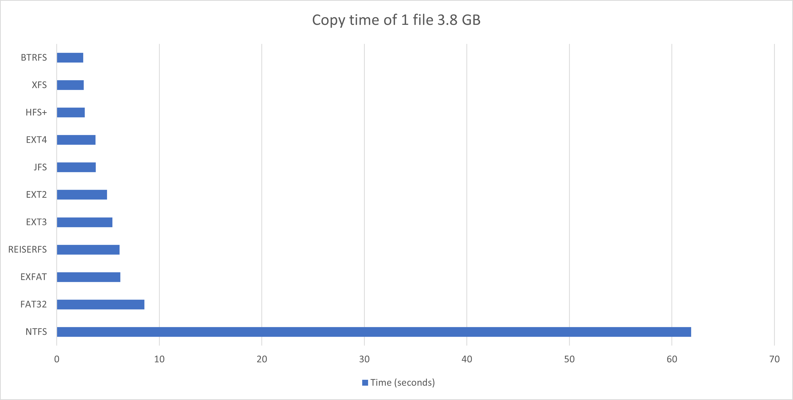
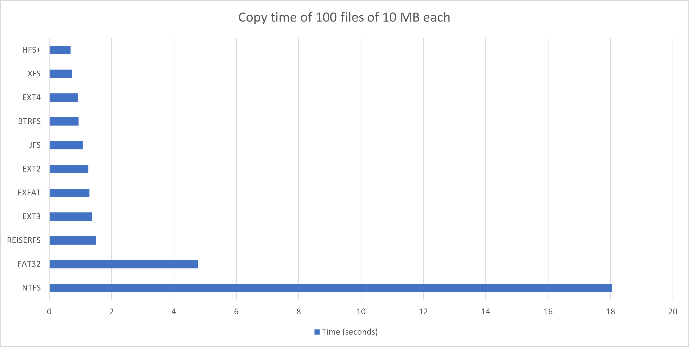
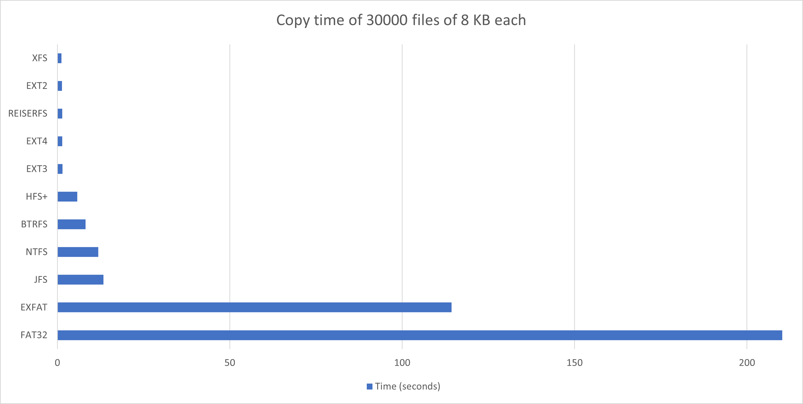
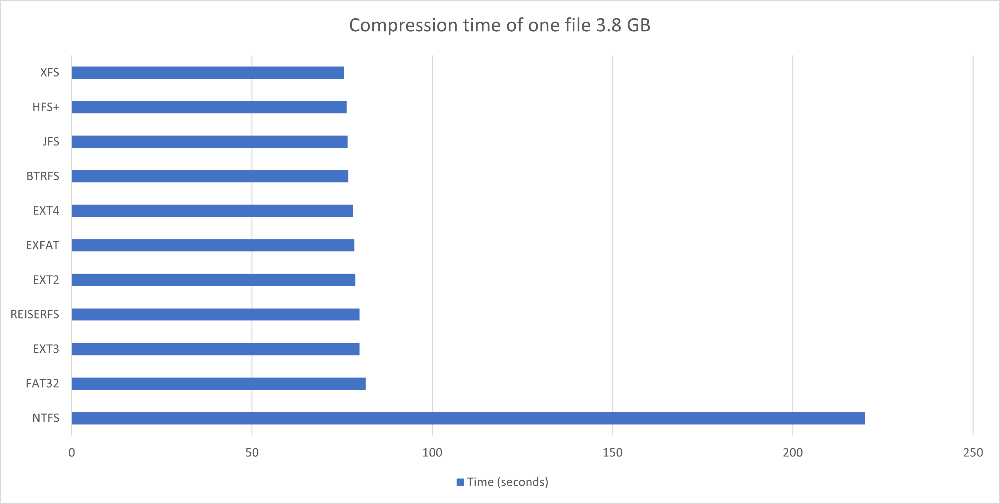
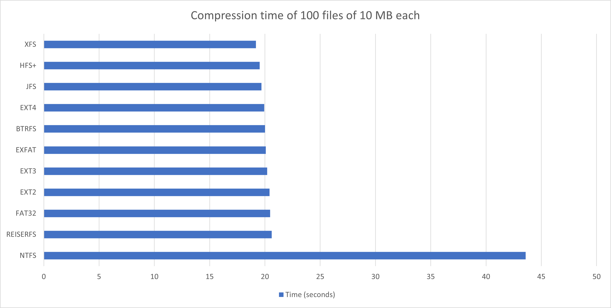
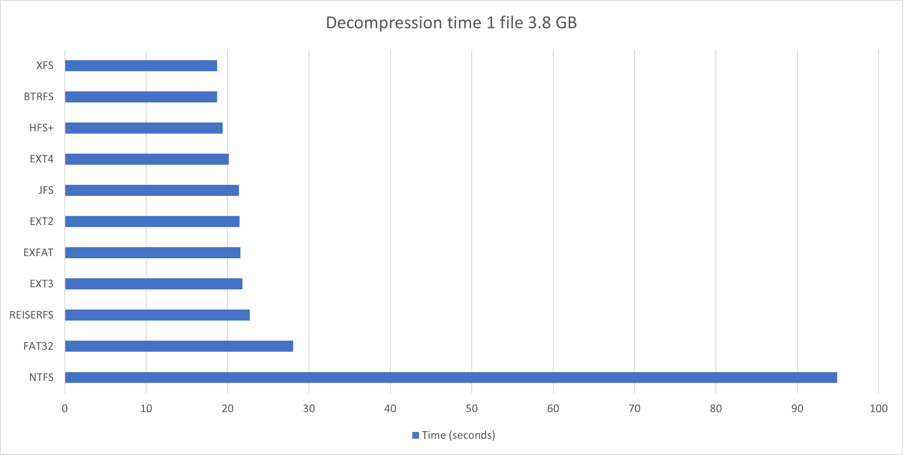
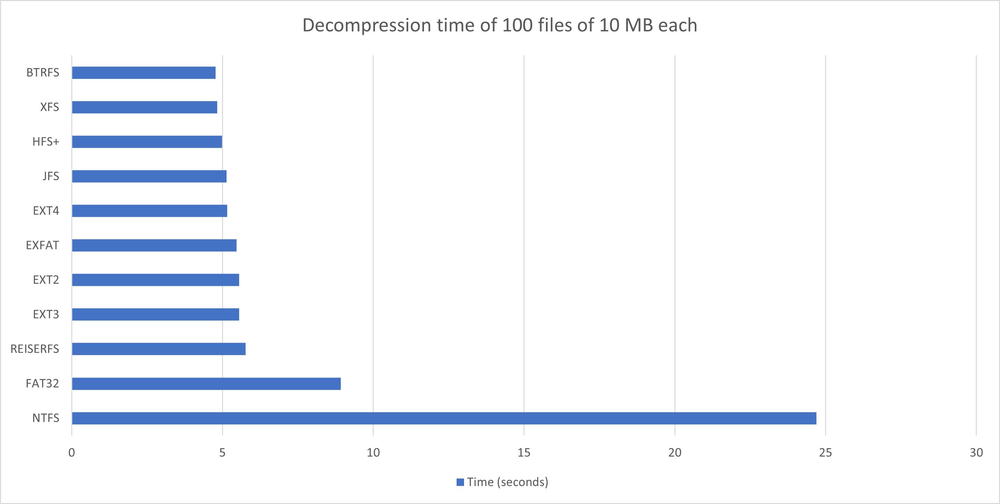
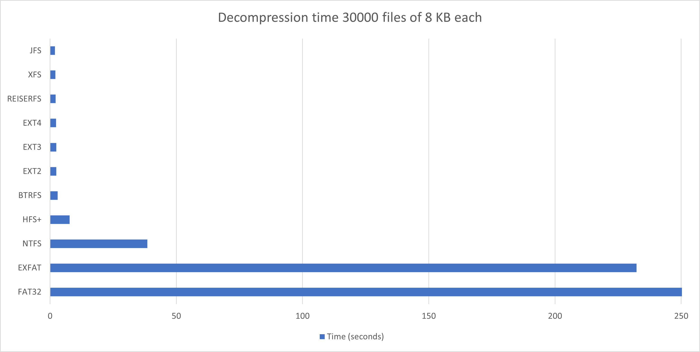
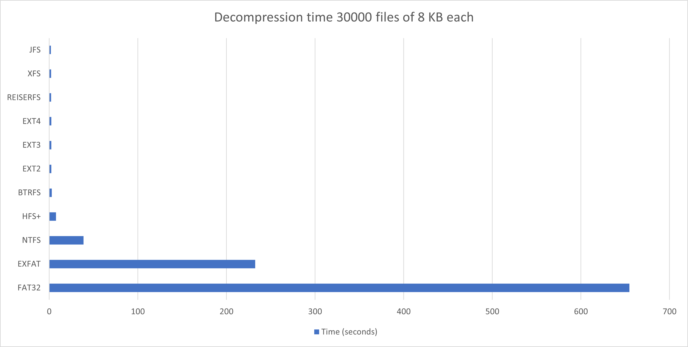

# Summary (SSD)
The summary includes a brief conclusion and a chart made in Microsoft Excel

## Read speed

## Copy time

### 1 file 3.8 GB

### 100 files of 10 MB each

### 30000 files of 8 KB each

## Compression time

### 1 file 3.8 GB

### 100 files of 10 MB each

### 30000 files of 8 KB each

## Decompression time

### 1 file 3.8 GB

### 100 files of 10 MB each

### 30000 files of 8 KB each

#### Limit x to 250

#### Limit x to 700

## Conclusion
The results are expected, although at some points I am surprised that the performance of NTFS and FAT32 is so bad. I was positively surprised by the performance of HFS+.

It is impossible to say which file system on Linux is the best. Often the differences are so small that they are probably due more to measurement error than actual file system performance.